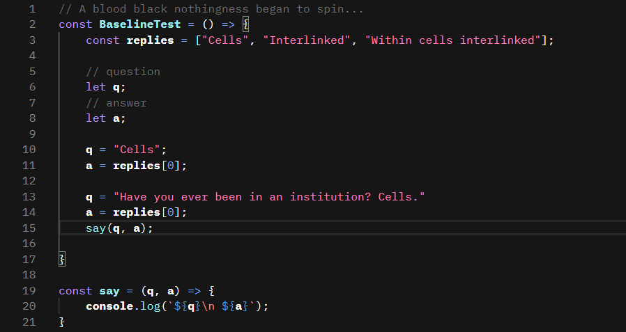

# IBM Carbon Color Theme  

Visual Studio Code color theme based on [IBM Carbon Design System](https://www.carbondesignsystem.com/) code snippets and [IBM Design Language](https://www.ibm.com/design/language/color/) color palette.  

This theme features syntax highlighting optimized for JavaScript, HTML, CSS, JSON and Markdown files as well as a fully fledged **workbench theme**.

  

## Recommended font

IBM Carbon Theme is made to work with [IBM Plex Mono](https://www.ibm.com/plex/) font so this is what I recommend using. You can download it [here](https://github.com/IBM/plex/releases/tag/v5.1.3).

### Configuration

After unpacking the font change your VS Code settings to include it.

## Credits
[IBM](https://www.ibm.com/)