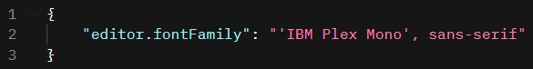

# IBM Carbon Color Theme  

A set of two Visual Studio Code color themes based on [IBM Carbon Design System](https://www.carbondesignsystem.com/) code snippets and [IBM Design Language](https://www.ibm.com/design/language/color/) color palette.  

Both themes are featuring syntax highlighting optimized for JavaScript, HTML, CSS, JSON, YAML, C++ and Markdown files (more filetypes coming!) as well as a fully fledged **workbench theme**.

### Standard theme optimized for readability

### Purist theme staying true to IBM Design Language

## Recommended font

IBM Carbon Theme is made to work with [IBM Plex Mono](https://www.ibm.com/plex/) font so this is what I recommend using. You can download it [here](https://github.com/IBM/plex/releases/tag/v5.1.3).

### Configuration

After unpacking the font change your VS Code settings to include it.

## Credits
[IBM](https://www.ibm.com/)

## Contributions

If you want to contribute to this project, you can go to it's [GitHub repo](https://github.com/eXotech-code/ibm-carbon-color-theme) and fork it. I would be very glad for programmers using languages such as Java, Rust or C to build support for those languages into IBM Carbon Theme!

Don't know how to edit this theme? [Here you go](https://code.visualstudio.com/api/extension-guides/color-theme).

Thanks for choosing IBM Carbon Color Theme!